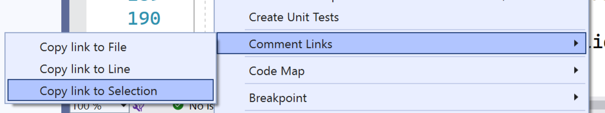

# CommentLinks

[](LICENSE)


[](https://github.com/mrlacey/CommentLinks/actions/workflows/build.yaml)


[Available in the Visual Studio marketplace](https://marketplace.visualstudio.com/items?itemName=MattLaceyLtd.CommentLinks)

See it in action (click image to open YouTube)  
[](https://www.youtube.com/watch?v=UtWlXKJ8cxE)

Create links between any files. Useful if your project or solution contains code in multiple languages or you wish to link to documentation files also in the solution.

- Open the file
- Open the file and go to a specific line
- Open the file and go to specific text
- Open any file (as specified by absolute path)
- Run arbitrary commands.

When a comment contains the text `link:` followed by a file name, a green button will be added that when clicked will open that file.


## Link options

There are lots of ways to customize the linking experience.

### Go to a specific line number

You can open the file at a specific line by putting `#L` and the line number (e.g. `#L25`) immediately after the file name.

```cs
// link:mapManager.js#L25
```

### Go to specific text within a file

You can open the file at a place where specific text is found by placing `:` immediately after the file name and then the text to search for.  
For compatibility with [text fragment anchors](https://github.com/WICG/ScrollToTextFragment) you can also use `#:~:text=` after the file name to specify text.

The following two links have the same behavior.

```cs
// link:mapManager.js:UpdateLocalData
// link:mapManager.js#:~:text=UpdateLocalData
```

Searching starts from the top of the file and goes down line by line.

Any words after the file name or search term should be automatically ignored. If you find that something isn't being detected correctly you can escape the name (and, optionally, search terms) by enclosing them in quotes.
This is also how you support search terms that include spaces.

```cs
// Go to link:"include/mapManager.js" and see ...
```

### Include partial file paths

Files will be found anywhere in the solution, even in other projects. If you have more than one file with the same name, you can specify the directory name the file is in too.

```cs
// link:include/mapManager.js
```

### Open files outside the solution

Open any file from disk by specifying the full path.

```cs
// See the log file at link:C:\Temp\logs\analysis-report.log
```

### Open files in a parent directory

Open a file anywhere in the file structure above the current file.  
For example, the following will search for, and open, a file called `README.md` in any directory in the current path.

```cs
// link:...\README.md
```

### Run commands from a link

Run arbitrary commands to open files or invoke applications by including `run>` after `link:` and before the command to execute.

```cs
// Change personalization settings to see the full effect link:run>ms-settings:personalization
// Open a command window - link:run>cmd.exe
// Pass arguments to an application:- link:run>"cmd.exe /?"
// Open a file (in the default app) - link:run>C:\path\to\document.pdf
```

### Navigate within the same file

It is possible to navigate within the same file by specifying the name of the file.
When navigating within a file specified by name, any search term will be looked for when opening another file, but will not match the line containing the link that was clicked.

There are also shortcuts for navigating within the same file to a specified search term.

#### Search higher in the same file

You can prompt to search above the line with the link by specifying `^` instead of the file name.

```cs
// Link:^:"some text"
```

When using a link like the one above, it will start on the line above the link and search up towards the top of the file.
If the search text is not found, the focused line will not change.


#### Search lower in the same file

You can prompt to search below the line with the link by specifying `v` instead of the file name.

```cs
// link:v:Something
```

When using a link like the one above, it will start on the line below the link and search down towards the bottom of the file.
If the search text is not found, the focused line will not change.


## Create links

Creating links is easy. Right-click where you want the target of a link, or select the text to search for and easily copy the link to the clipboard so you can paste it where you need it.



---

Functionality has increased over time in response to feedback. [Change Log](https://github.com/mrlacey/CommentLinks/blob/main/CHANGELOG.md)

Please [raise an issue](https://github.com/mrlacey/CommentLinks/issues/new) if you have feature requests.
